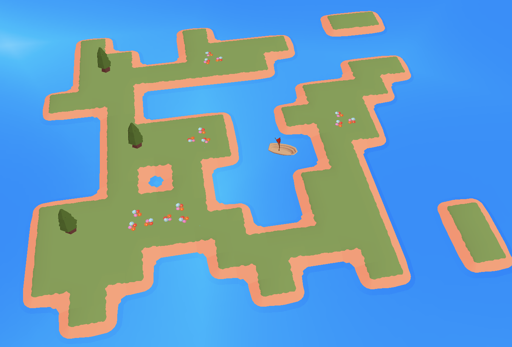

# Cade-WFC - Superposition Seas

Wave Function Collapse 3D within Godot 4. Originally implemented by Martin Donald, modified and adapted by Cade Brown as part of their Heriot Watt 4th Year Undergraduate Honours Project.

The tech can be played in brower at itch.io - https://ctrlcade.itch.io/superposition-seas, password is "cade" 

**NOTE:** Some technical issues restrict it from being playable on MacOS, Safari or Firefox, these are not caused by the implementation itself however. Google Chrome and Microsoft Edge seem to be able to play it on a Windows OS, I have not tested this with a Unix-based OS or anything else so your milage may vary. There are also some unintentional graphical issues within the playable demo (e.g. boat missing sail), likely a rendering engine issue. I would have created an executable of the tech demo but I do not have access to a Windows OS with Godot as this was developed within macOS.

A video demonstration of the tech demo is available - https://www.youtube.com/watch?v=5uF-9YGcn74

# Tools

Godot Engine v4.0.2 - https://godotengine.org \
Blender v3.4.1 - https://www.blender.org

# Sources

Wave Function Collapse Godot Implementation by Martin Donald - https://youtu.be/2SuvO4Gi7uY & https://www.patreon.com/bolddunkley \
Short Stack Font by James Grieshaber - https://fonts.google.com/specimen/Short+Stack?category=Handwriting
